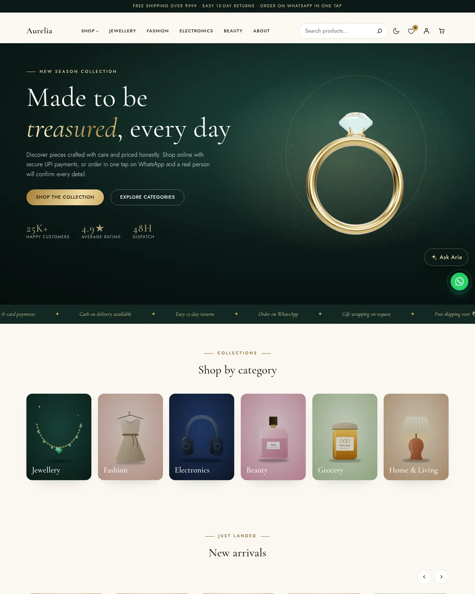
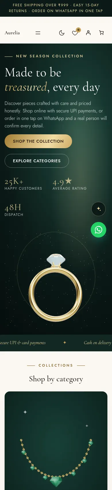
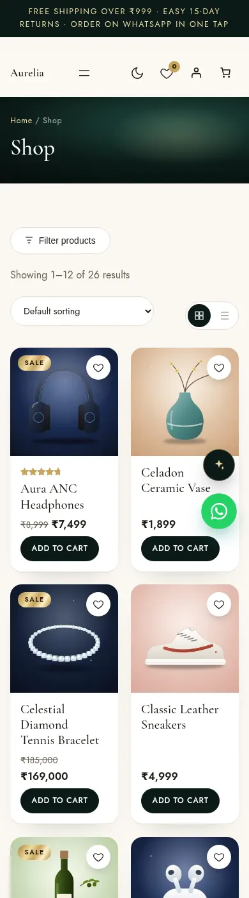
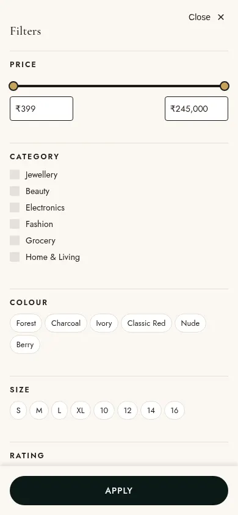
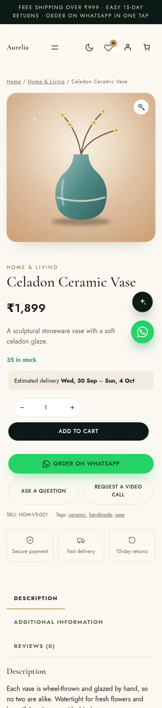
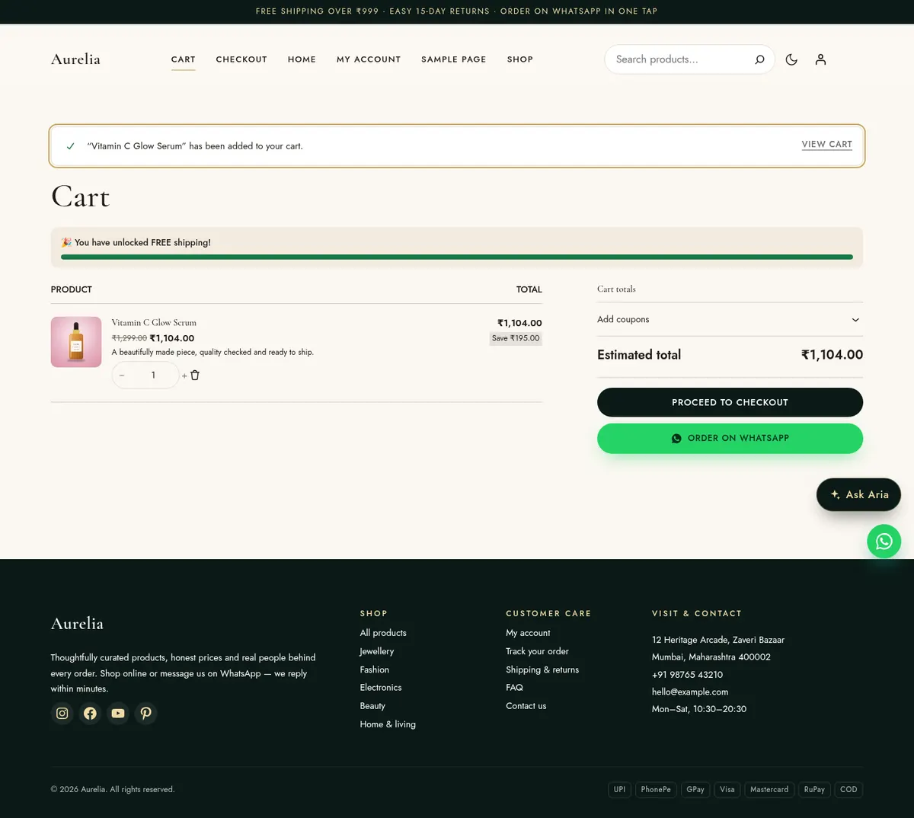
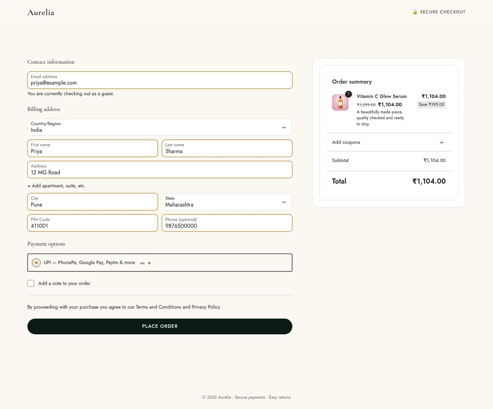
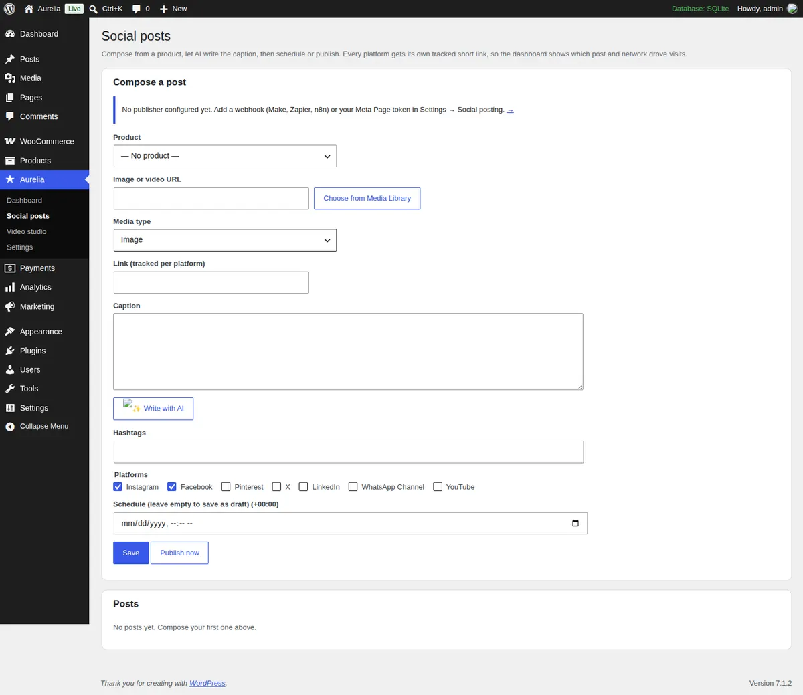
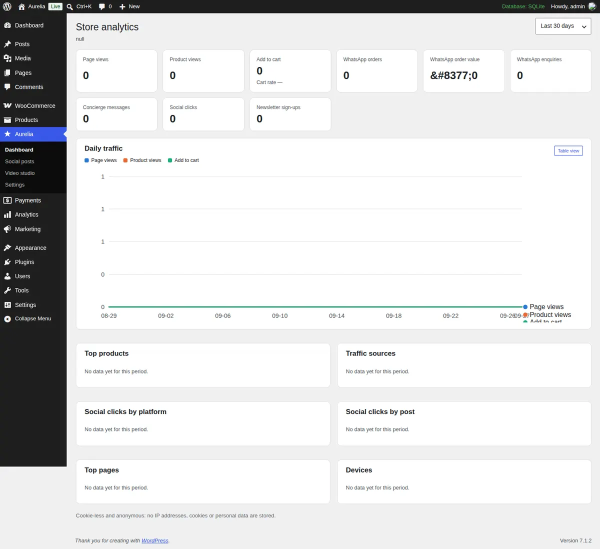
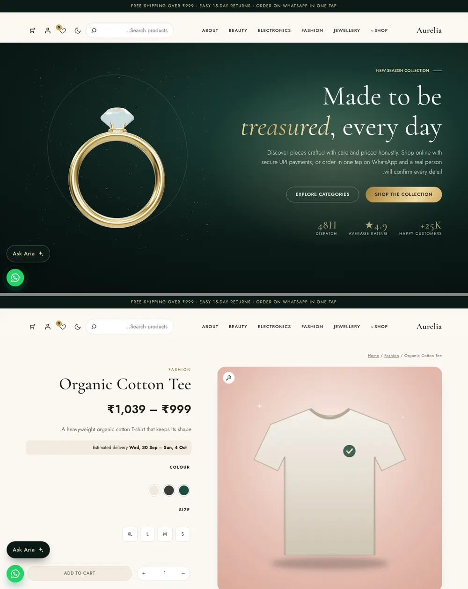

# Aurelia: WooCommerce block theme + Aurelia Commerce plugin

**English** · [हिन्दी](README.hi.md)

Aurelia is a WooCommerce block theme for any kind of shop: jewellery, fashion, electronics, beauty, grocery or home. **Aurelia Commerce** is the plugin that goes with it and adds the store features: WhatsApp ordering, UPI QR payments, an AI shopping concierge, a 3D viewer, a video studio, social posting, analytics and SEO.

The theme handles presentation only, so it works without the plugin. The plugin also works with other block themes.

| Requirement | Version |
|---|---|
| WordPress | 6.6 or newer (tested up to 7.1) |
| PHP | 8.1 or newer |
| WooCommerce | 9.0 or newer (tested up to 11.1), HPOS and Cart/Checkout blocks supported |

**[▶ Try the live demo](https://playground.wordpress.net/?blueprint-url=https://raw.githubusercontent.com/calculatewellhub-cell/e-commerce-theme/claude/charming-archimedes-euq210/playground/blueprint.json)**: a full demo store running in your browser through WordPress Playground, with no hosting and no sign-up. It takes about a minute to load and resets when you close the tab.



<p>




</p>

## Contents

1. [Features](#features)
2. [Install](#install)
3. [Setup wizard](#setup-wizard)
4. [WhatsApp number and WhatsApp ordering](#whatsapp-number-and-whatsapp-ordering)
5. [Payments: UPI QR, COD and gateways](#payments-upi-qr-cod-and-gateways)
6. [Claude API key (AI concierge)](#claude-api-key-ai-concierge)
7. [Social posting: webhook and Meta setup](#social-posting-webhook-and-meta-setup)
8. [Real cron](#real-cron)
9. [Switching style variations](#switching-style-variations)
10. [Demo content](#demo-content)
11. [Analytics, SEO and privacy](#analytics-seo-and-privacy)
12. [Languages](#languages)
13. [Development](#development)
14. [Defaults](#defaults)

## Features

**Theme (`aurelia`)**
- Seven style variations: Luxe (emerald and gold, the default), Noir, Fashion, Electronics, Beauty, Grocery and Minimal. Every colour, font, size, radius and shadow comes from `theme.json`.
- Light and dark mode. The mode follows the visitor's device and can be toggled from the header. The theme also supports RTL, is translation-ready and ships a Hindi translation.
- Store templates: shop, category, tag, attribute, product search, product, cart, checkout and order confirmation. Blog templates: home, archive, search, single, page variants and 404.
- Header: sticky, with a mega menu, product search, account, wishlist, dark-mode toggle and mini-cart.
- More than 35 patterns:
  - Heroes: 3D, image and split.
  - Shop sections: category tiles, product carousels, promo banners, countdown sale and trust badges.
  - Social proof and content: testimonials, FAQ, brand logos, gallery, newsletter and WhatsApp steps.
  - Full pages: home, about and contact.
- Filters and grid use WooCommerce's own blocks (Product Collection and interactive Product Filters), so they keep working through WooCommerce updates.
- Accessibility: tested against WCAG 2.2 AA with axe, visible focus styles, reduced-motion support and 24px minimum touch targets. Fonts are self-hosted and preloaded, and there is no jQuery on the front end.

**Plugin (`aurelia-commerce`)**
- **WhatsApp:**
  - "Order on WhatsApp" from product pages, the cart and the side cart, with prices checked on the server.
  - Optional WooCommerce order ("Pending – WhatsApp") with a pay link.
  - Enquiry and video-call buttons, plus a floating chat button.
- **UPI QR payments** in the Checkout block, alongside Cash on Delivery or any gateway plugin.
- **AI concierge (Claude):** answers from your live catalogue. The key stays on the server and requests are rate-limited per visitor. Without a key, a rule-based assistant answers instead.
- **3D viewer:** a built-in ring model or your own GLB/GLTF file. three.js only loads when a shopper opens the viewer.
- **Image → video studio:** turns product photos into Reels, Shorts and feed videos in the browser, then saves them to the Media Library.
- **Social posting:** schedule posts to Facebook and Instagram, or to any network through Make, Zapier or n8n. Every platform gets its own tracked short link.
- **Analytics:** cookie-less and anonymous, stored in your own database.
- **SEO and AI search:**
  - Structured data that extends Yoast, Rank Math or AIOSEO instead of duplicating them.
  - `llms.txt`, AI crawler rules in robots.txt, and a product feed.
- **Shop features:**
  - Live search, quick view, wishlist, compare and swatches.
  - Grid/list toggle, and load more or infinite scroll.
  - Sticky add-to-cart bar, delivery estimate, size guide and review photos.
  - Recently viewed products, "Frequently bought together" and a free-shipping progress bar.
  - Sale countdowns, a newsletter popup (off by default) and an announcement bar.

<p>


</p>

## Install

Download `aurelia.zip` and `aurelia-commerce.zip` from the [latest release](../../releases/latest), or build them yourself with `bash tools/build-zips.sh`.

1. Install and activate **WooCommerce**. You can use Plugins → Add New, or run `wp plugin install woocommerce --activate`.
2. **Theme:** go to Appearance → Themes → Add New Theme → **Upload Theme**. Choose `aurelia.zip`, then Install and **Activate**.
3. **Plugin:** go to Plugins → Add New Plugin → **Upload Plugin**. Choose `aurelia-commerce.zip`, then Install and **Activate**.
4. The setup wizard opens automatically.

> If an upload fails with "The link you followed has expired", your host's upload limit is too small. Raise `upload_max_filesize` and `post_max_size` to 16M, or upload the unzipped folders to `wp-content/themes/` and `wp-content/plugins/` over SFTP.

## Setup wizard

You can reopen the wizard at any time from **Aurelia → Setup wizard**. Every step can be skipped.

1. **Look:** pick what you sell. The wizard applies the matching style variation, for example Electronics for a gadget shop.
2. **Store details:** name, phone, address and state code (for example MH, DL, KA). These are used in emails, invoices, WhatsApp messages and structured data.
3. **WhatsApp & payments:**
   - Your WhatsApp number and WhatsApp mode.
   - Cash on Delivery.
   - Your UPI ID and payee name for QR payments.
4. **AI & social:** your Claude API key and social webhook (both optional).
5. **Demo content:** import the full demo store, or skip. See [Demo content](#demo-content).
6. **Ready:** **Launch my store** turns off WooCommerce's "Coming soon" mode so shoppers can see the store.

After the wizard, replace the sample contact details. The footer and the Contact page ship with a placeholder address, phone (`+91 00000 00000`) and email (`hello@example.com`). Edit the footer in **Appearance → Editor → Patterns → Footer**, and the Contact page in **Pages**.

## WhatsApp number and WhatsApp ordering

Go to **Aurelia → Settings → WhatsApp**.

- **WhatsApp number:** use the international format with digits only, no `+`, spaces or dashes. For India, `91` followed by the 10-digit mobile number, for example `919876543210`. Use a WhatsApp Business number if you can.
- **Checkout mode:**
  - **Show alongside normal checkout** (the default): shoppers can pay online or order on WhatsApp.
  - **Replace checkout with WhatsApp ordering:** the cart sends shoppers straight to WhatsApp. This suits catalogue-style shops.
- **Create a WooCommerce order for each WhatsApp order:**
  - Each WhatsApp order becomes a WooCommerce order with the status **Pending (WhatsApp)**, so stock, reports and invoices stay correct.
  - The WhatsApp message includes the order number. With "Include an online payment link" on, it also includes a link where the customer can pay by UPI or card.
- Buttons can be switched on or off individually: product page, cart, enquiry, "Request a video call", and a floating button (bottom right or left).

When a shopper taps the button, WhatsApp opens with the items, options, quantities, prices and total already filled in. The prices are read from the database on the server, so the message cannot be tampered with.

## Payments: UPI QR, COD and gateways

**UPI QR (built in).** Go to WooCommerce → Settings → **Payments** → **UPI** and fill in:

- **Your UPI ID (VPA):** for example `yourstore@okhdfcbank` or `9876543210@ybl`. You can find it in PhonePe, Google Pay or Paytm under your profile.
- **Payee name:** usually your business name as registered with your bank.
- **Static QR image URL (optional):** your printed shop QR, shown as a backup.

How it works for the shopper:

1. The shopper picks UPI at checkout and places the order.
2. The thank-you page shows a **QR code for the exact amount** and a **"Pay with UPI app"** button that opens PhonePe, Google Pay, Paytm or BHIM on a phone.
3. After paying, the shopper enters the 12-digit **UTR / UPI reference**.
4. The order stays **On hold**, with the UTR added as an order note, until you check the payment in your bank or UPI app and move the order to **Processing**.

**Cash on Delivery** is WooCommerce's standard COD method. The wizard can switch it on.

**Automatic confirmation and cards:** install a gateway plugin such as Razorpay, PhonePe PG, Cashfree, PayU or Paytm from Plugins → Add New. They appear in the Checkout block next to UPI and COD, and the theme styles them automatically.

## Claude API key (AI concierge)

1. Create an account at [console.anthropic.com](https://console.anthropic.com), add billing, and create an **API key** under Settings → API keys.
2. Go to **Aurelia → Settings → AI concierge**, paste the key into **Claude API key**, then click **Test connection**.
3. Optional settings:
   - Assistant name, greeting, suggested questions and extra instructions (tone, topics to avoid).
   - Shipping and returns policy text.
   - FAQs. The FAQ blocks on your pages are added automatically.
   - Messages per visitor per 10 minutes (rate limit).

To keep the key out of the database, put it in `wp-config.php` instead. The field then shows "Set in wp-config.php":

```php
define( 'AURELIA_ANTHROPIC_API_KEY', 'sk-ant-...' );
```

Security and cost:

- The key is only used on your server, through `wp_remote_post`, and never reaches the browser.
- Requests are rate-limited per visitor using a hashed IP with a daily salt, so no IP addresses are stored.
- Replies are kept short. The catalogue context is cached for 12 hours, and the prompt is sent with Claude's prompt caching.

The default model is `claude-opus-5`. You can enter another model ID under **Model**, for example `claude-sonnet-5` for lower cost. If the API is unreachable, or the model declines a request, the shopper gets a polite fallback reply with a WhatsApp hand-off. With no key at all, a rule-based assistant searches your catalogue by keyword and budget.

## Social posting: webhook and Meta setup

Posts are composed under **Aurelia → Social posts**:

1. Pick a product.
2. Let **✨ Write with AI** draft the caption.
3. Choose the platforms and schedule the post, or publish it now.

Every platform gets its own tracked link, `https://yourshop.com/go/<post-id>/<platform>/`. The link redirects with UTM tags and counts clicks on the dashboard.



You can publish in two ways. **When a webhook is set, it is used for all platforms.**

### Option A: webhook (Make, Zapier, n8n)

This works for every network: Instagram, Facebook, Pinterest, X, LinkedIn, WhatsApp Channel and YouTube.

1. In Make, Zapier or n8n, create a scenario that starts with a **Custom webhook** trigger and copy its URL.
2. Paste the URL into **Aurelia → Settings → Social posting → Publishing webhook**.
3. Each post is sent as JSON:

```json
{
  "id": 123,
  "brand": "Your Store",
  "mediaUrl": "https://yourshop.com/wp-content/uploads/reel.mp4",
  "mediaType": "video",
  "link": "https://yourshop.com/product/linen-wrap-dress/",
  "posts": [
    { "platform": "instagram", "caption": "✨ Meet the…", "trackedLink": "https://yourshop.com/go/123/instagram/" },
    { "platform": "pinterest", "caption": "…", "trackedLink": "https://yourshop.com/go/123/pinterest/" }
  ]
}
```

4. In your scenario, add a router on `posts[].platform` and connect each branch to the matching module, such as Instagram for Business, Pinterest or LinkedIn. Return any 2xx status to mark the post as published.

### Option B: direct Meta Graph API (Facebook Page + Instagram)

You need a Facebook **Page**, with an Instagram **Professional** (Business or Creator) account linked to that Page.

1. At [developers.facebook.com](https://developers.facebook.com), create an app of type **Business**, then add the **Facebook Login for Business** and **Instagram Graph API** products.
2. Open **Graph API Explorer**, choose your app, and generate a **User token** with these permissions:
   - `pages_show_list`
   - `pages_read_engagement`
   - `pages_manage_posts`
   - `instagram_basic`
   - `instagram_content_publish`
3. Exchange it for a **long-lived** token with the Access Token Debugger's "Extend access token". Then call `GET /me/accounts`. The `access_token` next to your Page is a **Page token** that does not expire.
4. Find your Instagram Business account ID with `GET /<page-id>?fields=instagram_business_account`.
5. Go to **Aurelia → Settings → Social posting** and fill in the **Facebook Page ID**, **Instagram Business account ID** and **Meta Page access token**. Leave the webhook empty.

Notes:

- Instagram needs an image or video at a **public HTTPS URL**, so a local or password-protected site will not work.
- Reels are uploaded asynchronously. The plugin checks their processing status on the next cron runs.
- You can put the token in `wp-config.php` instead: `define( 'AURELIA_META_TOKEN', '...' );`

## Real cron

WordPress's built-in scheduler (WP-Cron) only runs when someone visits the site. Scheduled posts, Instagram processing and analytics clean-up then run late on quiet sites. Use a real cron job instead:

1. Add this line to `wp-config.php`, above "That's all, stop editing!":

   ```php
   define( 'DISABLE_WP_CRON', true );
   ```

2. Add a cron job that runs every 5 minutes. In cPanel, use **Cron Jobs**. On a VPS, run `crontab -e`.

   ```cron
   */5 * * * * curl -s https://yourshop.com/wp-cron.php?doing_wp_cron > /dev/null 2>&1
   ```

   Or, if WP-CLI is installed:

   ```cron
   */5 * * * * wp cron event run --due-now --path=/var/www/yourshop > /dev/null 2>&1
   ```

The exact commands for your site are shown under **Aurelia → Settings → Social posting**. The plugin registers an "Every five minutes (Aurelia)" schedule for social publishing, and a daily job for analytics retention.

## Switching style variations

Go to **Appearance → Editor → Styles → Browse styles** and pick a variation:

| Variation | Palette | Fonts |
|---|---|---|
| Luxe (default) | Emerald and gold | Cormorant Garamond / Jost |
| Noir | Luxe in permanent dark mode | Cormorant Garamond / Jost |
| Fashion | Monochrome and blush | Bodoni Moda / Manrope |
| Electronics | Electric blue | Space Grotesk / Inter |
| Beauty | Plum and rose | Fraunces / DM Sans |
| Grocery | Fresh green | Outfit / Nunito Sans |
| Minimal | Black and white | Inter |

Click **Save**. The whole store changes, including patterns, buttons, product cards, checkout and dark mode. You can also fine-tune colours and fonts in the same panel, or rerun the wizard's **Look** step.

Section styles (Dark section, Primary section, Soft section, Card) and block styles (Accent button, Eyebrow, Arch and Rounded images) are available in the block sidebar under **Styles**.

## Demo content

The wizard's **Demo content** step, or `wp aurelia demo import`, adds:

- 26 products across six categories, with images, colour and size variations, swatches, 3D rings and reviews.
- The coupons `TODAY15` and `WELCOME10`.
- Pages: Home, About, Contact, FAQ, Shipping & returns, Wishlist, Compare, Track order and Journal.
- The main menu, with a mega menu.

Everything imported is tracked, so it can be removed cleanly. **Aurelia → Setup wizard → Demo content → Remove demo content**, or `wp aurelia demo remove`, deletes only the demo items. Your own products and pages are never touched.

## Analytics, SEO and privacy

- **Dashboard** (Aurelia → Dashboard):
  - Page and product views, cart rate and WhatsApp orders and their value.
  - Concierge chats, social clicks by platform and post, traffic sources and devices.
  - Each chart has a table view.
  - Data is stored in `wp_aurelia_events`, with no cookies, IP addresses or personal data. Retention is set under Settings → Analytics & SEO.
- **Structured data:** Product (with offers, reviews and shipping or return policy), Store/LocalBusiness, WebSite with search, breadcrumbs and FAQPage.
  - When Yoast, Rank Math or AIOSEO is active, their graph is extended instead of duplicated.
  - Open Graph tags are skipped when one of those plugins is active.
- **AI search (AIO):**
  - `/llms.txt` and `/llms-full.txt` summarise your store for AI assistants.
  - robots.txt allows AI crawlers (configurable).
  - `/product-feed.xml` is a Google Merchant and Meta catalogue feed.
- **Privacy:** privacy-policy text is suggested under Settings → Privacy, and newsletter emails are included in WordPress's personal data export and erase tools.



## Languages

- The theme and plugin are fully translatable. Templates use translatable patterns, so no strings are hard-coded in HTML.
- Hindi (`hi_IN`) translations ship in `theme/languages/` and `plugin/languages/`. They load automatically when **Settings → General → Site Language** is set to हिन्दी.
- Templates for other languages are `theme/languages/aurelia.pot` and `plugin/languages/aurelia-commerce.pot`. Translate them with Poedit or Loco Translate.
- RTL languages are supported. The layout, icons and carousels mirror automatically.



## Development

```bash
npm ci                          # esbuild, three.js, qrcode-generator (optional: playwright, sharp)
npm run build:js                # bundle the 3D viewer and QR library into plugin/assets/js
npm run build:styles            # regenerate theme.json and styles/*.json from tools/build-styles.py
bash tools/build-zips.sh        # dist/aurelia.zip and dist/aurelia-commerce.zip

composer install                # WordPress Coding Standards
vendor/bin/phpcs                # lint theme and plugin (WPCS 3, PHP 8.1+ compatibility)
```

**Translations:** to update the POT files, run the commands below. `--skip-theme-json` and the helper script are needed only when the machine cannot reach develop.svn.wordpress.org.

```bash
wp i18n make-pot theme theme/languages/aurelia.pot --domain=aurelia --skip-theme-json
python3 tools/i18n-theme-json.py theme theme/languages/aurelia.pot /path/to/wordpress/wp-includes/theme-i18n.json
wp i18n make-pot plugin plugin/languages/aurelia-commerce.pot --domain=aurelia-commerce --exclude=assets/js/viewer,assets/js/vendor,assets/src
wp i18n make-mo theme/languages && wp i18n make-mo plugin/languages
```

**Continuous integration:**
- `.github/workflows/lint.yml` runs on every push and pull request:
  - PHPCS.
  - A PHP 8.1–8.4 syntax check.
  - JSON validation.
- `.github/workflows/release.yml` rebuilds the JS bundles and zips. It attaches the zips to a GitHub release when you publish a release or push a `v*` tag.

**Layout:**

```
theme/    block theme: theme.json, styles/, templates/, parts/, patterns/, assets/, languages/
plugin/   aurelia-commerce: includes/ (one class per feature), assets/, languages/
tools/    build scripts (styles, JS, demo art, zips, i18n)
docs/     screenshots
```

## Defaults

These are the defaults chosen for a new store. All of them can be changed in the wizard or in settings.

- **Store basics:** currency INR (₹); store country India (Maharashtra). Shipping is a flat ₹79 and free over ₹999, with dispatch within 48 hours and delivery in 2–7 days.
- **Payments:** Cash on Delivery and UPI QR. WhatsApp ordering runs **alongside** normal checkout, and WhatsApp orders create a WooCommerce order.
- **Style:** Luxe (emerald and gold). Dark mode follows the visitor's device.
- **AI concierge:** model `claude-opus-5`, with 20 messages per visitor per 10 minutes. It falls back to a rule-based assistant when no key is set.
- **Shop:** "Load more" pagination; live search, quick view, wishlist, compare, swatches and the sticky add-to-cart bar are all on.
- **Marketing:** the newsletter popup is **off**. The announcement bar and trust badges are on.
- **Analytics:** on, cookie-less, with 180 days of retention. All structured data is on, and AI crawlers are allowed.

## Licence

GPL-2.0-or-later.
- **Fonts:** SIL Open Font License. Credits are in `theme/readme.txt`.
- **Demo images:** generated for this project and released under GPL.
